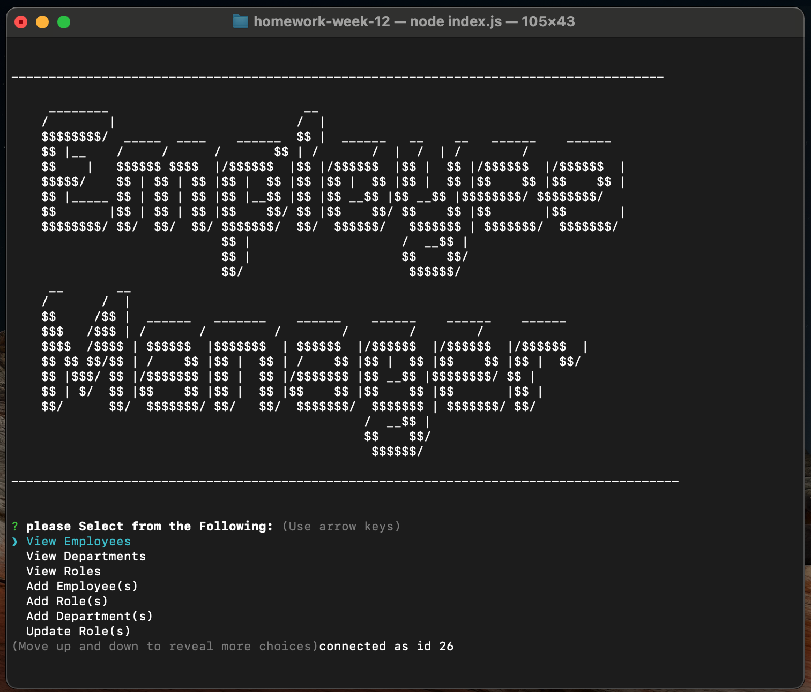
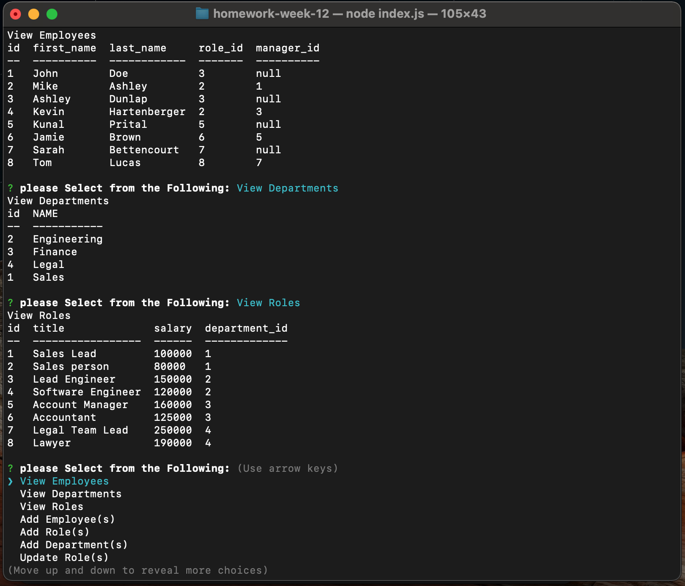

# Homework week 12 Employee Tracker with JS
    
## Table of Contents
* [Description](#description) 
* [Installation](#installation)
* [Usage](#usage)
* [Credits](#credits)
* [License](#license)
* [Badge](#badge)
* [Questions](#questions)
    
## Description
* CLI JS program using inquirer to list, add, delete, and track departments, employees and employee roles
    
## Installation
* install the program using the full file directory. Copy it to appropriate machine to run and use node JS with inquirer.
    
## Usage
* launch program in the main directory by typing node index.js.  From there, pick which item you would like to view or do, i.e. view employees, view departments, add employees, add roles, remove employees, etc.  Select Exit to exit the program.

    
## Credits
* N/A
    
## License
* Licensed by mit
    
## Badge
* none
    
## Questions
* For any questions, concerns, or additional help, please contact klucas72@hotmail.com.
